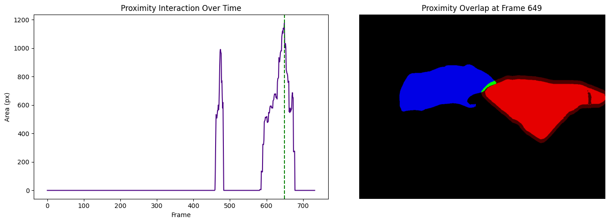

# Movement: Segmentation Mask Interaction PoC

A Proof of Concept (PoC) demonstrating how to integrate dense, 2D instance segmentation masks into the `movement` behavioral kinematics library. 

This repository serves as the technical foundation for my Google Summer of Code proposal. Following the insightful discussions on the `movement` Zulip community, this PoC explores how we can move beyond traditional single-point tracking to utilize the rich spatial data provided by modern vision models like SAM 2 and OCTRON.

## Project Origin & Dataset

This PoC is built using a custom dataset generated from scratch. I processed publicly available behavioral footage (see Citation) through the OCTRON framework (SAM 2 based) to produce the dense instance segmentation masks used in this analysis. This demonstrates the full compatibility of the proposed movement integration with modern tracking outputs.

## The Intuition: Overcoming 2D Occlusion
In top-down behavioral videos, animals frequently occlude (block) one another. Modern instance segmentation algorithms are strictly exclusive; they assign a specific pixel to only one object. 

Because of this, even when two animals are physically touching or sniffing, their digital masks rarely overlap in the raw data array. If we simply look for intersecting pixels, the result is almost always zero.

**The Solution: Proximity Auras via Morphological Dilation**
To accurately detect physical interactions, we need to account for this 2D occlusion. We achieve this by borrowing a concept from image processing:
1. We take the boolean mask of the first individual.
2. We apply morphological dilation (using `scipy.ndimage`) to expand the mask outward by a defined pixel radius. This creates a virtual "proximity aura" around the animal.
3. We then calculate the intersection between this expanded aura and the raw body mask of the second individual.

If the second animal breaches this aura, we successfully register a physical interaction or close-proximity social event.

## Results & Visualization
The pipeline processes the Zarr arrays and outputs a noise-free, highly accurate temporal interaction graph alongside a spatial verification frame. 

* **Red:** Mouse 1 (Core body)
* **Dark Red:** The mathematically generated proximity aura
* **Blue:** Mouse 2 (Core body)
* **Bright Green:** The interaction zone (Overlap between Mouse 1's aura and Mouse 2's body)



## Data Access & Citation
The tracking data used in this PoC was generated by processing a publicly available behavioral video using OCTRON.
* **Original Video Source:** [Pet Mouse Social Interactions: The KISS](https://youtu.be/cFKSwzEsGtg?si=LdbSWL3Ioae9n79C)

Instance segmentation data is inherently large. Due to GitHub's file size constraints, the high-resolution Zarr mask datasets (~800MB) used in this demo are hosted externally.

**[Download the Test Dataset](https://drive.google.com/drive/folders/1oddqyZV6HKdhk44feEFnP2i0bY1sBXcg?usp=sharing)**

Once downloaded, simply extract the `octron-mouse-interaction` folder and place it directly in the root directory of this repository (in the same folder as the `.ipynb` file).

## Quick Start (Isolated Environment)
To ensure complete reproducibility without conflicting with your existing installations, please run this notebook in an isolated virtual environment.

```bash
# 1. Clone the repository
git clone https://github.com/egoistpizza/movement-segmentation-poc.git
cd movement-segmentation-poc

# 2. Create and activate a virtual environment
python3 -m venv .venv
source .venv/bin/activate  # On Windows use: .venv\Scripts\activate

# 3. Install dependencies
pip install --upgrade pip
pip install -r requirements.txt

# 4. Register the environment with Jupyter
python -m ipykernel install --user --name=mask_poc_env --display-name="Mask PoC Env"

# 5. Launch Jupyter Notebook
jupyter notebook
```

When the notebook opens, ensure the kernel is set to "Mask PoC Env". Make sure the octron-mouse-interactions folder is present in the root directory before running the cells.

## Future Work

During the GSoC period, the goal is to refine this isolated PoC, generalize the mathematical approach for N-individuals, and integrate it natively into the movement ecosystem as an accessible, high-performance feature for behavioral scientists.

## License
This project is licensed under the MIT License - see the [LICENSE](LICENSE) file for details.